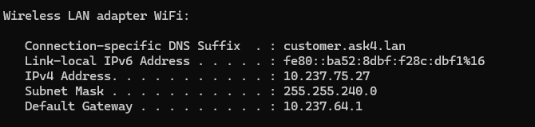

# Mittweida Day-Trip Guide (Frontend)

This project is a web application that displays day-trip tour routes in Mittweida and allows users to leave feedback on their journey.

---

## 🚀 How to Run the Frontend

1. **Clone this repository**:
   ```bash
   git clone https://github.com/DaniyarKz0205/mittweida-frontend.git
   cd mittweida-guide
   ```

2. **Install dependencies and start the development server**:
   ```bash
   npm install
   npm run dev
   ```

3. 📱 **To access from your phone**:

    - Make sure your phone and computer are on the same Wi-Fi.
    - Get your local IP address:
        - **On Windows:** Open PowerShell → type `ipconfig`
        - Find the `IPv4 Address` (e.g., `10.237.75.27`)
    - In `src/SummaryWrapper.tsx`, update this line:
      ```ts
      fetch('http://172.17.208.88:3000/reviews', {
      ```
      Replace `172.17.208.88` with your actual IP (e.g., `10.237.75.27`).

4. 🔗 Then access the frontend on your phone via:
   ```
   http://<your-ipv4>:5173
   ```

---

## 🔁 Backend Connection

To store reviews, this app sends POST requests to a backend server.  
Make sure to clone and run the backend repo: [Review App](https://github.com/DaniyarKz0205/mittweida-backend)

---

## 🧠 Tech Stack

- React + TypeScript
- React Router
- Vite
- Communication with backend via `fetch`

---

## 📬 Feedback API

This app sends user feedback via:
```
POST http://<your-ipv4>:3000/reviews
```

Payload example:
```json
{
  "routeId": "forest-trail",
  "review": "Amazing!",
  "stars": 5,
  "timestamp": "2025-07-16T20:00:00Z"
}
```

---

## 📷 Screenshot – IPv4 Lookup Example (Windows)


